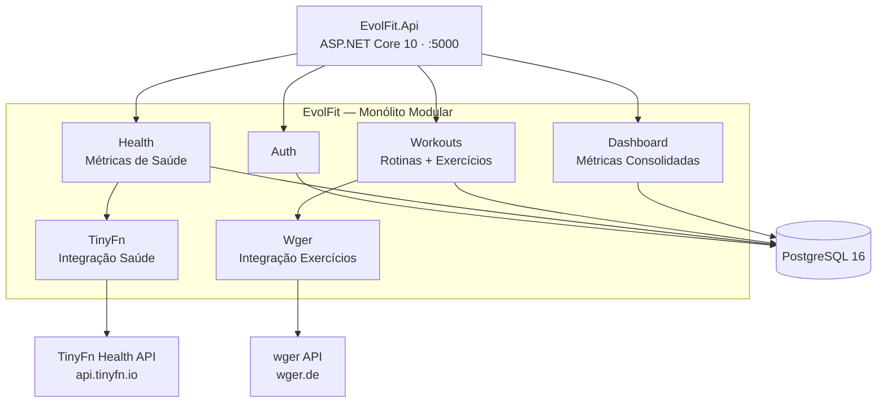

# EvolFit — Plataforma de Fitness e Saúde


**EvolFit** é um sistema web de fitness e saúde para **academias**, **personal trainers** e **usuários individuais**. Centraliza em um único lugar o registro de **Métricas de Saúde** (IMC, BMR, TDEE), **Rotinas de Treinos** personalizadas e **Acompanhamento Diário** de exercícios — tudo com cálculos automáticos via **TinyFn Health API** e um banco de dados extenso de exercícios via **wger API**.

> "O EvolFit é o companheiro inteligente da sua jornada fitness."

---

## Visão Geral

O EvolFit resolve o problema de fragmentação de informações fitness: peso, treinos e evolução ficam espalhados em apps diferentes, planilhas ou cadernos. Aqui, tudo converge para um dashboard unificado onde o usuário registra sua saúde, gera treinos personalizados e acompanha a evolução diária.

### Por que EvolFit?

| Problema | Solução |
|---|---|
| Cálculos de IMC, BMR e TDEE feitos manualmente ou em apps genéricos | TinyFn Health API com cálculos automáticos e precisos |
| Listas de exercícios desatualizadas ou genéricas | wger API com banco de dados de exercícios completo e atualizado |
| Falta de histórico e evolução ao longo do tempo | Dashboard com gráficos e métricas consolidadas |
| Treinos genéricos que não consideram objetivo individual | Rotinas geradas automaticamente com base em objetivo, período e partes do corpo |
| Dados espalhados em múltiplos apps | Plataforma unificada com todas as informações em um só lugar |

---

## Stack

| Camada | Tecnologia |
|---|---|
| **Backend** | .NET 10 · C# 13 · **Monólito Modular** (Clean Architecture + DDD) · Repository + Unit of Work |
| **ORM** | EF Core 10 + Npgsql |
| **Migrations** | DbUp (SQL versionadas) |
| **Banco** | PostgreSQL 16 (banco único, schema único `public`) |
| **Validação** | FluentValidation |
| **Mapeamento** | AutoMapper |
| **Integração Saúde** | TinyFn Health API (`api.tinyfn.io/v1/health/`) — IMC, BMR, TDEE, calorias |
| **Integração Exercícios** | wger API (`wger.de/api/v2/`) — banco de dados de exercícios |
| **Autenticação** | JWT (access 2h / refresh 7 dias) + BCrypt.Net |
| **Observabilidade** | Serilog (structured JSON) · Health Checks |
| **Testes** | xUnit · FluentAssertions · NSubstitute · Testcontainers |
| **Infra** | Docker + Docker Compose · GitHub Actions |

---

## Arquitetura

Princípios: Clean Architecture, Domain-Driven Design sobre um **Monólito Modular** — **uma única aplicação** (`EvolFit.Api`) com módulos por bounded context em `EvolFit.Application/Features/` (Auth, Health, Workouts, Dashboard, TinyFn, Wger). Banco único PostgreSQL com schema único `public`; isolamento por `user_id` em 100% das queries; os módulos **TinyFn** e **Wger** são os únicos que falam com o mundo externo.



---

## Funcionalidades Principais

| Módulo | Descrição |
|---|---|
| **Autenticação e Perfil** | Cadastro com nome, e-mail e senha (hash BCrypt.Net); login com JWT (access 2h + refresh 7 dias) |
| **Métricas de Saúde** | Registro recorrente de peso/altura com cálculo automático de IMC, BMR e TDEE via TinyFn API |
| **Histórico de Saúde** | Lista paginada de medições, evolução do IMC ao longo do tempo |
| **Rotinas de Treinos** | Geração automática com base em objetivo, período (7–180 dias) e partes do corpo, usando exercícios reais da wger API |
| **Acompanhamento Diário** | Lista de exercícios do dia com marcação de conclusão (ExerciseLog) |
| **Dashboard** | Métricas consolidadas: IMC atual, TDEE, rotinas ativas, % conclusão, evolução do IMC |

### Roadmap resumido

| Fase | Foco | Duração |
|---|---|---|
| **Fase 1 — MVP** | Auth, métricas TinyFn, rotinas wger, dashboard | Semanas 1–9 |
| **Fase 2 — Expansão** | Perfil, notificações, CSV, i18n, filtros | Semanas 10–18 |
| **Fase 3 — Inteligência** | Sugestões, benchmarks, wearables, PWA | Semanas 19–30 |
| **Fase 4 — Escala** | Multi-tenancy, dashboard treinador, API pública | Semanas 31–40 |

> Detalhes completos em [ROADMAP.md](ROADMAP.md) e [BACKLOG.md](BACKLOG.md).

---

## Começando

### Pré-requisitos

| Ferramenta | Versão |
|---|---|
| [.NET SDK](https://dotnet.microsoft.com/download/dotnet/10.0) | 10.0+ |
| [Docker](https://www.docker.com/) | 24+ (com Docker Compose) |
| [Chave TinyFn](https://tinyfn.io) | Obtida gratuitamente (100 req/mês) |

### 1. Configure as variáveis de ambiente

`ExternalApis:TinyFn:ApiKey` deve ser informada via variável de ambiente ou appsettings (ver SECURITY.md).

### 2. Suba a infraestrutura

```bash
docker compose up -d
```

### 3. Execute a aplicação

```bash
cd src/EvolFit.Api
dotnet restore
dotnet build
dotnet run
```

A API sobe em `http://localhost:5000` (Scalar em `/scalar`).

### 4. Valide o ambiente

```bash
# Health check de liveness
curl http://localhost:5000/health

# Health check de readiness (banco + integrações)
curl http://localhost:5000/ready

# Primeiro usuário
curl -X POST http://localhost:5000/api/auth/register \
  -H "Content-Type: application/json" \
  -d '{"name":"Teste","email":"teste@evolfit.app","password":"Senha@123"}'
```

### 5. Rodando os testes

```bash
dotnet test tests/EvolFit.UnitTests
dotnet test tests/EvolFit.IntegrationTests
```

> Requer Docker rodando para os Testcontainers (TEST_PLAN Seção 3).

---

## Estrutura de Pastas

```text
src/
├── EvolFit.Api/               # API ASP.NET Core 10 (controllers, middlewares, Program.cs)
├── EvolFit.Application/       # Use cases, DTOs, validadores (CQRS/MediatR)
├── EvolFit.Core/              # Domain: entidades, value objects, enums, interfaces
└── EvolFit.Infrastructure/    # EF Core, repositórios, TinyFn/wger clients, DbUp
tests/
├── EvolFit.UnitTests/
├── EvolFit.IntegrationTests/
└── EvolFit.E2ETests/
db/migrations/                 # Scripts SQL versionados (DbUp)
```

---

## Documentação

A documentação completa está nesta pasta — a **MASTER_SPECIFICATION_EvolFit.md** é a fonte única de verdade (single source of truth); todos os demais documentos derivam dela.

| Documento | Conteúdo |
|---|---|
| [MASTER_SPECIFICATION_EvolFit.md](MASTER_SPECIFICATION_EvolFit.md) | Especificação mestre do projeto (39 seções) |
| [README.md](README.md) | Visão geral e início rápido (este documento) |
| [documento_EvolFit.md](documento_EvolFit.md) | Produto, personas, requisitos e regras de negócio |
| [ARQUITETURA_EvolFit.md](ARQUITETURA_EvolFit.md) | Arquitetura detalhada (Clean Architecture, DDD, integrações) |
| [MODELAGEM_BANCO.md](MODELAGEM_BANCO.md) | Modelagem de dados (DDL completo) |
| [API_REFERENCE.md](API_REFERENCE.md) | Referência de APIs REST + endpoints |
| [SECURITY.md](SECURITY.md) | Segurança (JWT, BCrypt.Net, proteção de API keys) |
| [TEST_PLAN.md](TEST_PLAN.md) | Plano de testes (pirâmide, cobertura, E2E) |
| [DEPLOY.md](DEPLOY.md) | Deploy e infraestrutura (ambientes, backup, release) |
| [BACKLOG.md](BACKLOG.md) | Backlog priorizado |
| [ROADMAP.md](ROADMAP.md) | Roadmap de 40 semanas (Fases 1–4) |
| [GUIA_USO_EvolFit.md](GUIA_USO_EvolFit.md) | Guia de uso por persona |
| [Proposta_Tela_EvolFit.md](Proposta_Tela_EvolFit.md) | Wireframes de telas (UX) |

---

## Licença

Código-fonte **proprietário**. Documentação interna da equipe. Todos os direitos reservados. Proibida a reprodução ou distribuição sem autorização.

Os dados provenientes da TinyFn Health API e da wger API são utilizados de acordo com os termos de uso de cada serviço.

---

**Versão:** 1.0.0 · **Status:** Approved · **Última atualização:** 2026-09-10
